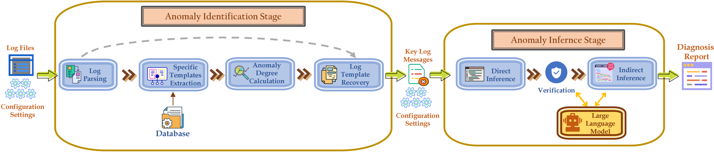

# Introduction
The repository shows the source code of LogConfigLocalizer proposed in the paper **Face It Yourselves: An LLM-based Two-stage Strategy to Localize Configuration Errors via Logs**.

-----------
# Parser
To make use of it, please refer to [README](https://github.com/shanshw/LogConfigLocalizer/blob/main/src/parser/README.md) in src/parser.

# Localizer
To make use of it, please refer to [README](https://github.com/shanshw/LogConfigLocalizer/blob/main/src/localizer/README.md) in src/localizer.

# Reproduction
For the experimental results, please refer to the [benchmark](benchmark/README.md). 

To reporduce the results in the paper, please refer to [README](ttps://github.com/shanshw/LogConfigLocalizer/blob/main/src/scripts/README.md) in src/scripts.

